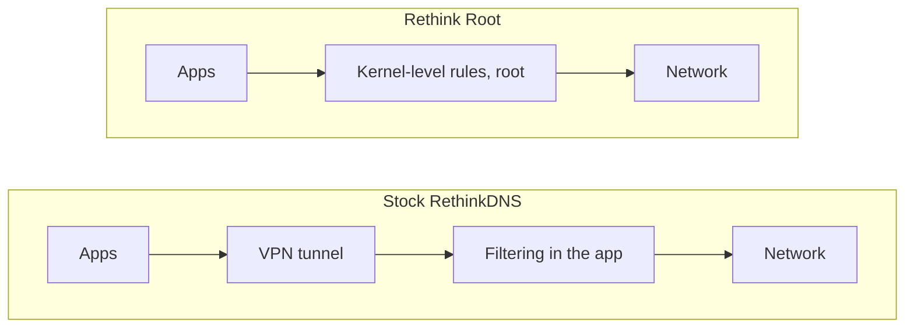

 

[Work](#selected-work) &nbsp;·&nbsp; [How Rethink Root works](#how-rethink-root-works) &nbsp;·&nbsp; [Background](#background) &nbsp;·&nbsp; [Earlier projects](#earlier-projects)

 

I'm Venkata Naga Kusal Kotte, an AI and Data Science undergraduate at Shiv Nadar University Chennai, class of 2028.

I build open source software for the parts of computing most people never question: where your time data goes, who holds your files, and what sits between your phone and the network. Five of those projects are below. Three are finished, one is underway, and one is going slower than I'd like.

 

## Selected work

<table>
<tr>
<td width="50%" valign="top">

**[Soul Track](https://github.com/kusal630/TIme-tracker)**
 `Kotlin` &nbsp; 

A private time tracker that accounts for every second of your day and keeps all of it on the device. It produces a growth score and a breakdown of where your time went, and includes a to-do list with a Pomodoro timer.

It also notices when you've been in your comfort zone for too long and says so.

</td>
<td width="50%" valign="top">

**[LocalVault](https://github.com/kusal630/local-cloud-storage)**
 `Dart` &nbsp; 

Turns the SSD or phone storage you already own into a personal cloud you can reach from anywhere. No subscription, and no company holding your files.

</td>
</tr>
<tr>
<td width="50%" valign="top">

**[Rethink Root for Android](https://github.com/kusal630/rethink-root-level-android)**
 `Kotlin` &nbsp; 

A fork of RethinkDNS, the Mozilla Builders Android app. The original filters traffic through a VPN tunnel. This version runs at kernel level with root privileges instead, offloads the firewall to the root level, and adds a power profile focused on battery life.

</td>
<td width="50%" valign="top">

**[Rethink Root for Linux](https://github.com/kusal630/rethink-root-linux)**
 `Python` &nbsp; 

The same approach on the desktop: a system-wide DNS firewall with per-app blocking and a proxy, running with sudo or root on any Linux machine.

</td>
</tr>
<tr>
<td colspan="2" valign="top">

**[PurePad](https://github.com/kusal630/purepad)**
 `Python` &nbsp; 

A LineageOS-based build for the Realme Pad 1, with the goal of running Android 16 on a low-end tablet the manufacturer has moved on from. Not shipped yet, and it will be late.

</td>
</tr>
</table>

 

## How Rethink Root works

Stock RethinkDNS needs a VPN tunnel to see your traffic. Root mode removes the tunnel and moves enforcement into the kernel.

 

## Background

| | |
|---|---|
| **Shell.ai Hackathon** | Top 100 globally. Predicted fuel properties from raw data with XGBoost, CatBoost and LightGBM. |
| **IIT Jammu Winter School** | Built a study assistant agent at the Gen AI and AI Agents program, December 2025 to March 2026. |
| **Education** | AI and Data Science, Shiv Nadar University Chennai, 2028. |

 

## Earlier projects

Open the list

 

| Project | What happened | Stack |
|---|---|---|
| **FuelPropertiesPredictor** | The Shell.ai entry. The leaderboard climb came from feature engineering and careful validation, not a fancier model. | XGBoost, CatBoost, LightGBM |
| **Predictive Maintenance Scheduling System** | Began as a DBMS assignment and grew into a full-stack app with a 21-table Postgres schema and an ML pipeline for equipment failure. Most of the effort went into making the SRS, ER diagrams and real schema agree. | React, Python, PostgreSQL, Supabase |
| **Study Assistant Agent** | The API call was the easy part. Keeping the model on topic and managing context across turns took the rest. | Python, OpenAI API, Gradio |
| **PollyGlot** | A translation app, mostly an exercise in never leaking an API key. Every OpenAI call goes through a backend. | Node.js, Express, OpenAI API |
| **Movie Watchlist** | Live data from a public movie API, with the watchlist kept in `localStorage` so it never leaves your browser. Fully keyboard-navigable. | JavaScript, REST API |
| **n8n Automation Pipelines** | A university management system and a student feedback sentiment pipeline. Webhook in, routing, an LLM node, result out. | n8n, OpenAI API |

Also on GitHub: [world-notes](https://github.com/kusal630/world-notes) (handwriting-first notes with palm rejection, Flutter), [vellum](https://github.com/kusal630/vellum) (Kotlin), [razorpay_ai_buildaton_real_solution](https://github.com/kusal630/razorpay_ai_buildaton_real_solution) (TypeScript) and [web-dev](https://github.com/kusal630/web-dev) (JavaScript).

 

## Stack

 

Building something interesting? Write to me at **kottekvnkusal@gmail.com**.

